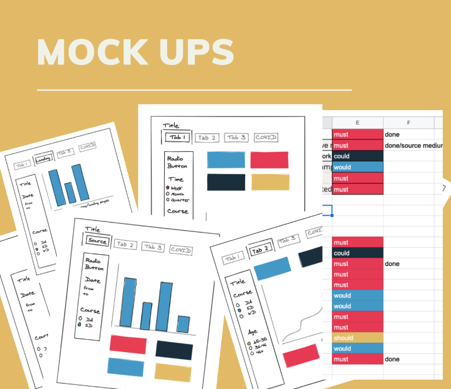
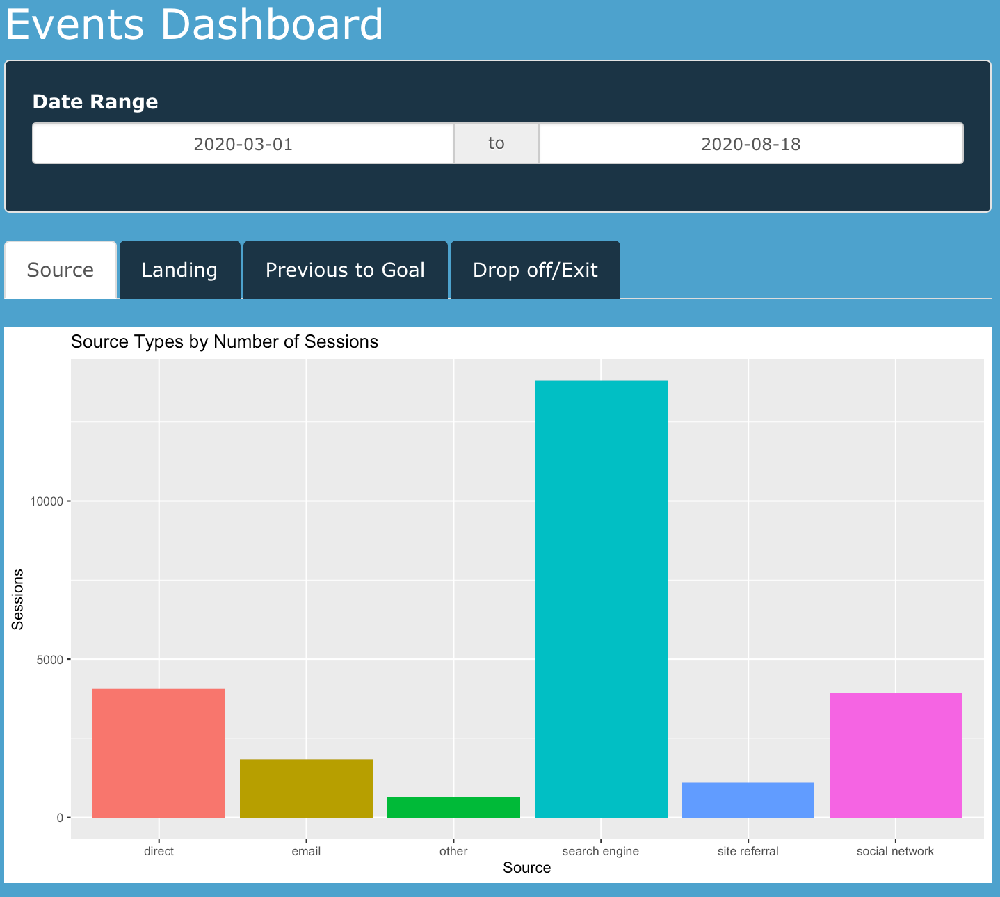
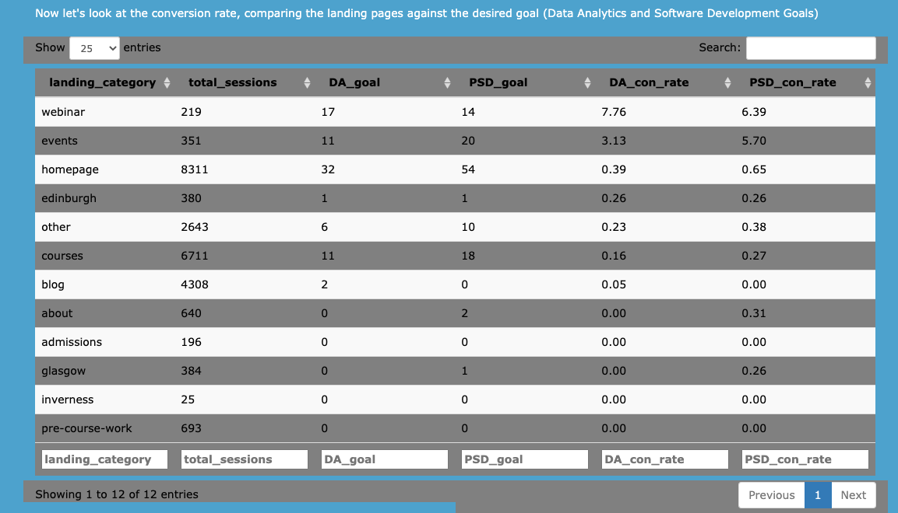
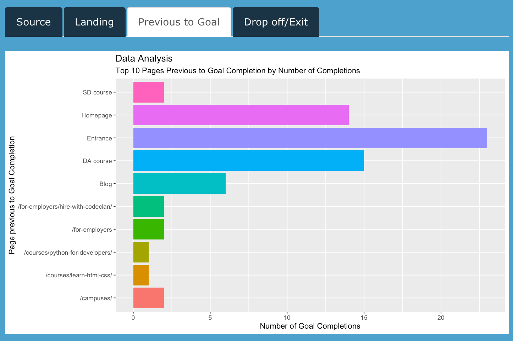
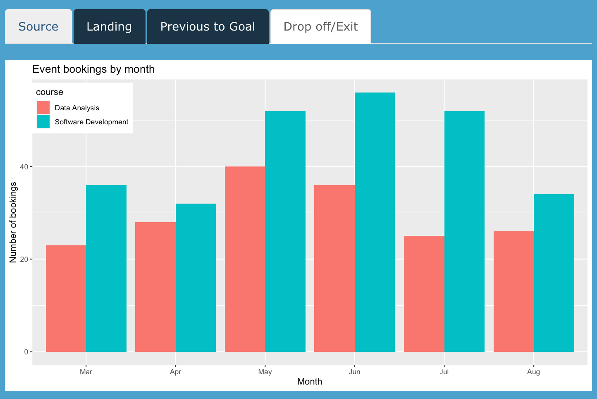
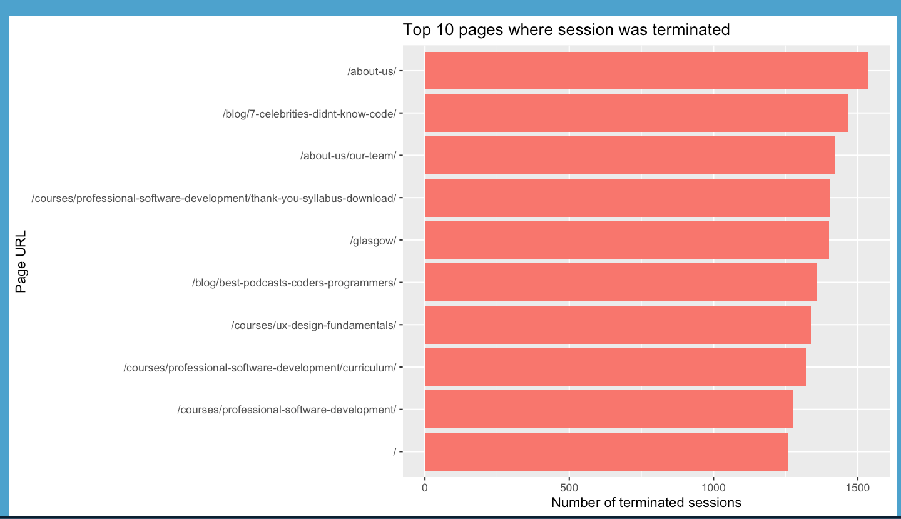

# Google Analytics R Shiny App

Authors: Gleb Vulf, David Wright and Conor Power.
​
A group project involving the planning, coding and presentation of a R Shiny dashboard style app.

The project took place over a week's period and all authors worked together on it remotely.

### Brief

The client wanted to better understand how their website users were navigating their site.

They wished for a focus on driving visitors to sign up for particular events and information sessions.

Only a small number of the total visitors who use the website actually book an event.

Key areas the client wanted to be considered:

* The journey users take
* How they arrive on the site
* Where they drop off.
* Any issues with the journey and any ways they may support event bookings

Can we increase event booking to 200 per month? If so, what changes would be recommended and how could these be monitored?

### Tools

We coded in R and used Google Analytics.

The data was extracted from 1/3/20 to 18/8/20 to a csv file from Google Analytics in an API call using the google_analytics library in R. The team agreed on the relevant dimensions and metrics which should be pulled.

The following libraries were used in creating the app:

library(shiny)
library(tidyverse)
library(lubridate)
library(forcats)
library(janitor)
library(data.table)
library(google_analytics)

### Synthesising the data

After presenting to the client, the data from Google Analytics was synthesised using the "synthpop" library in R. This was to protect the client and so that the app could be avaialble for public viewing
and use.

### How it came together

Firstly, we agreed on a shared set of principles for how we want to work:

* Open and transparent communication
* Stay in regular contact
* No idea is not worth considering
* Beware of  each others passionate personalities

We then had a look at the brief and began planning out an agreed work schedule. Additionally we got comfortable with data and its proposed functionality and prepared follow up questions for the client.

Here were some examples of mock-ups we made for our proposed dashboard app:

### What we would have liked to do with more time

* Explore Social Channels in more depth - Socials displayed a good return of primary goal.
* Explore more of the Journey - number of total pages, Avg time spent on each page etc, age/gender/location
* Dig deeper into drop offs - the data revealed some channels with large drops off’s
* Improve styling & infographics - we had planned to use more infographics to display data.
* Consider £$€ budgets - understanding the value of spend on socials/search would gather bigger insight
* Further data cleaning - assigning data into more categories. Generally dig deeper into different dimensions.

### Project Learnings

* Importance of planning
* Importance of listening/communication
* Sharing discoveries
* Push to GitHub!!! (no excuses)
* Everything isn’t possible, its about finding the most viable solutions
* Applying AGILE methodology
